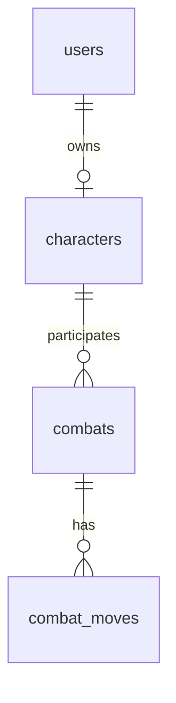

# Database and session design (high-load oriented)

This document reflects agreed decisions: **integer primary keys** (`BIGINT UNSIGNED AUTO_INCREMENT`), append-only combat log, **Memcached** for access tokens (no MySQL `MEMORY` engine for sessions).

## Principles

- **MySQL (InnoDB)** is the source of truth for durable game data.
- **Memcached** stores short-lived **opaque access tokens** mapped to a user id (TTL-based expiry).
- **No sliding TTL on every HTTP request** — session lifetime is renewed on **login** (new token + fresh TTL, e.g. **24 hours**). Fewer cache writes, simpler semantics.
- **Primary keys** are **unsigned integers** in the database. **Registration** exposes **`users.public_id`** (UUID v4 string) as API `player_id`, not the surrogate `users.id`.

## Identifiers

| Entity | PK type | Notes |
|--------|---------|--------|
| `users.id` | `BIGINT UNSIGNED` AI | Internal; FK target |
| `users.public_id` | `CHAR(36)` UNIQUE NOT NULL | API-facing player id (`player_id`) |
| `characters.id` | `BIGINT UNSIGNED` AI | |
| `combats.id` | `BIGINT UNSIGNED` AI | |
| `combat_moves.id` | `BIGINT UNSIGNED` AI | Append-friendly clustered inserts |

If you ever need strictly smaller row width and are sure volumes stay modest, `INT UNSIGNED` is possible; **`BIGINT UNSIGNED`** is the default recommendation for headroom and consistency.

## Tables (logical)

### `users`

- `id` `BIGINT UNSIGNED` PK, auto-increment  
- `public_id` `CHAR(36)` **UNIQUE** NOT NULL — opaque id returned as **`player_id`** from `register`  
- `status` `ENUM('active','inactive')` NOT NULL DEFAULT **`active`**  
- `created_at`, `updated_at`  

### `characters`

- `id` `BIGINT UNSIGNED` PK, auto-increment  
- `user_id` `BIGINT UNSIGNED` **UNIQUE** FK → `users.id` (one character per user unless requirements change)  
- `name`, `level`, `fights`, `fights_won`, `coins`, `skill_1`, `skill_2`, `skill_3` (skills 0–50 on create per TZ)  
- `version` `INT NOT NULL DEFAULT 0` — optimistic locking on updates after combat  
- `updated_at`  

### `combats`

- `id` `BIGINT UNSIGNED` PK, auto-increment  
- `participant_a_id`, `participant_b_id` `BIGINT UNSIGNED` FK → `characters.id`  
- `status` — e.g. `pending` / `active` / `finished` / `cancelled`  
- `winner_character_id` `BIGINT UNSIGNED` NULL  
- `started_at`, `finished_at` (nullable)  
- Optional: small `state` JSON if you need unstructured snapshot; keep indexed columns normalized for hot queries  

**Indexes (examples):**  
`(participant_a_id, status)`, `(participant_b_id, status)` for “find my active combat” (or complement with Memcached hot key, see below).

**Note:** numeric ids are **enumerable**; do not rely on them as secrets—authorization always via token/session.

### `combat_moves` (append-only)

- `id` `BIGINT UNSIGNED` PK, auto-increment  
- `combat_id` `BIGINT UNSIGNED` NOT NULL FK → `combats.id`  
- `turn_number` `INT` NOT NULL  
- `actor_character_id` `BIGINT UNSIGNED` NOT NULL  
- `payload` `JSON`  
- `created_at`  

**Unique:** `(combat_id, turn_number)` — avoids duplicate turns and races.  
Reads: `WHERE combat_id = ? ORDER BY turn_number` with pagination if history grows large.

## Sessions / access tokens (Memcached)

- **Not** stored in MySQL `MEMORY` tables — use Memcached (already in Compose) or add Redis later if you need richer TTL/structures.
- On **login**: generate opaque token (random bytes), `KEY =` prefix + hash of token (never store raw token as key if you log keys), `VALUE =` compact blob or JSON with **`user_id`** (numeric id), **`TTL = 86400`** (24h example).
- **Renewal:** new login issues a new token and **re-`SET`s** with full TTL; old tokens expire naturally unless you explicitly delete keys (e.g. single-session policy).
- **Multi-device:** define policy — allow multiple tokens per user (multiple keys) or maintain `user_id → current token id` and invalidate previous keys on login.

Suggested key shape (example): `cg:sess:{sha256_hex(token)}` — value: `user_id` + optional metadata (scopes, issued_at).

## Optional Memcached for combat read path

To reduce DB load on hot paths:

- `cg:combat:active:{character_id}` → `combat_id`, short TTL; invalidate on combat end.  
- `cg:char:{character_id}` → cached profile snapshot, short TTL; invalidate after stat updates.

DB remains authoritative; cache is safe to drop.

## ER overview

## Evolution

- **Redis** — consider if you need frequent `EXPIRE` updates, refresh-token rotation tables in memory, or sorted sets for matchmaking at scale.  
- **Sharding / global IDs** — if you later split MySQL, introduce application-level ids (snowflake, ULID) or a central id service; single-instance `AUTO_INCREMENT` is not unique across shards.  
- **Archival** — old `combat_moves` partitions by month when volume grows.
